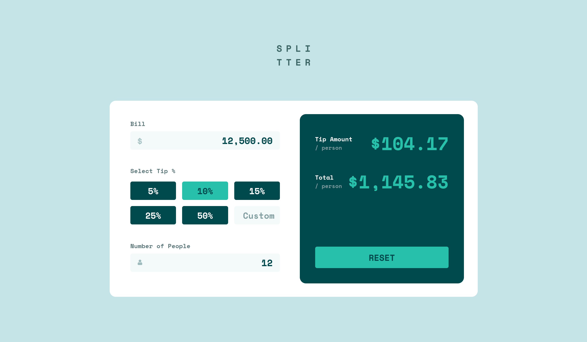
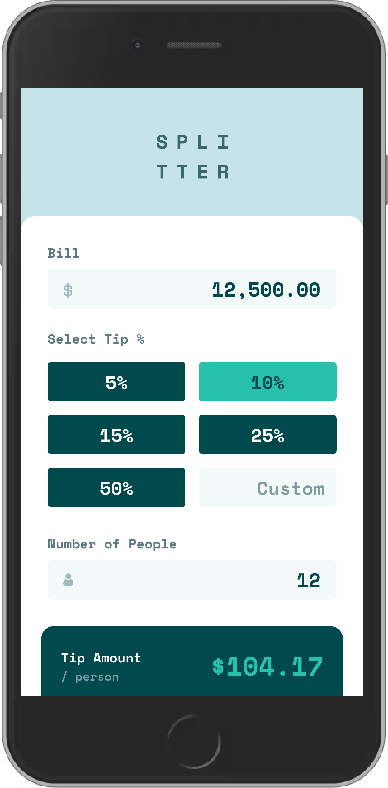
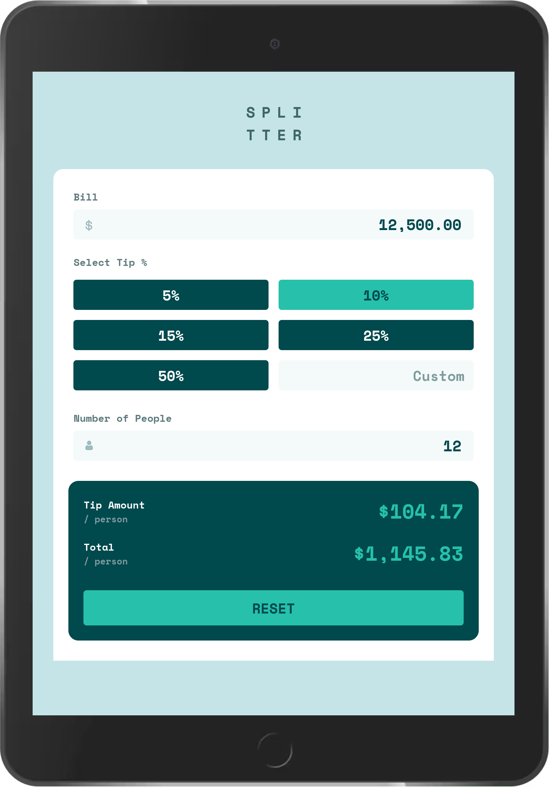

# Frontend Mentor - Tip calculator app solution

This is a solution to the [Tip calculator app challenge on Frontend Mentor](https://www.frontendmentor.io/challenges/tip-calculator-app-ugJNGbJUX). Frontend Mentor challenges help you improve your coding skills by building realistic projects.

## Table of contents

- [Overview](#overview)
  - [The challenge](#the-challenge)
  - [Screenshots](#screenshots)
  - [Links](#links)
- [My process](#my-process)
  - [Built with](#built-with)
  - [What I learned](#what-i-learned)
  - [Useful resources](#useful-resources)
- [Author](#author)

## Overview

### The challenge

Users should be able to:

- View the optimal layout for the app depending on their device's screen size
- See hover states for all interactive elements on the page
- Calculate the correct tip and total cost of the bill per person

### Screenshots





### Links

- [Solution codebase](https://github.com/CarlosCRG19/tip-calculator-app)
- [Live Site URl](https://carloscrg19.github.io/tip-calculator-app/)

## My process

I created this project to practice my recently acquired React knowledge. For the styles I implemented a mobile first approach and prioritized a declarative UI. For the components, I tried to distribute the logic in an understandable and clean way. I also tried to delegate some responsibility on custom hooks and utils.

### Built with

- Flexbox
- CSS Grid
- Mobile-first workflow
- [React](https://reactjs.org/) - JS library
- [Styled Components](https://styled-components.com/) - For styles

### What I learned

I relied a lot on different repositories and articles on best practices with React. I learned about Styled Components which provide a more declarative UI, about the use of the ContextAPI and tools to make the general workflow easier (e.g. using a linter for cleanliness and format).

```js
import React, { createContext, useContext, useState } from "react";

const BillContext = createContext();

const INITIAL_STATE = {
  initialBill: "0",
  initialTip: "10",
  initialNumberOfPeople: "1",
};

const BillProvider = ({ children, initialState = INITIAL_STATE }) => {
  const { initialBill, initialTip, initialNumberOfPeople } = initialState;

  const [bill, setBill] = useState(initialBill);
  const [tip, setTip] = useState(initialTip);
  const [numberOfPeople, setNumberOfPeople] = useState(initialNumberOfPeople);

  const isInitialState = () => {
    return (
      bill === initialBill &&
      tip === initialTip &&
      numberOfPeople === initialNumberOfPeople
    );
  };

  const resetBill = () => {
    setBill(initialBill);
    setTip(initialTip);

    setNumberOfPeople(initialNumberOfPeople);
  };

  const value = {
    bill,
    setBill,
    tip,
    setTip,
    numberOfPeople,
    setNumberOfPeople,
    resetBill,
    isInitialState: isInitialState(),
  };

  return <BillContext.Provider value={value}>{children}</BillContext.Provider>;
};

const useBill = () => {
  const context = useContext(BillContext);

  if (context === undefined) {
    throw new Error("useBill must be used withing a BillProvider");
  }

  return context;
};

export { BillProvider, useBill };
```

### Useful resources

- [How to use React Context effectively](https://kentcdodds.com/blog/how-to-use-react-context-effectively) - This article helped me to get a better grasp on the ContextAPI and its use cases.
- [Jira clone](https://github.com/oldboyxx/jira_clone) - This is an amazing project which I got inspiration from, specially regarding architecture and on how to fully exploit Styled Components.

## Author

- Github - [CarlosCRG19](https://github.com/CarlosCRG19)
- LinkedIn - [carloscrodriguezg](https://www.linkedin.com/in/carloscrodriguezg/)
